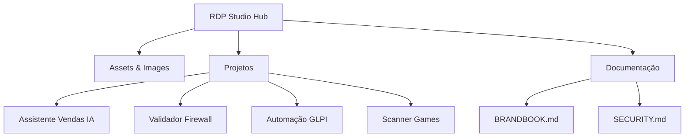

# RDP STUDIO - Hub de Engenharia e Inovação


> **Engenharia Criativa & Funcional.**
> Soluções de alto impacto focadas em Cloud, Cibersegurança e Automação com IA.

---

## 📋 Visão Geral

Este repositório hospeda o **Hub Central da RDP Studio**, uma vitrine interativa que centraliza projetos de engenharia de software desenvolvidos por **Marcelo Rodrigues**. Mais do que um portfólio, é uma demonstração de arquitetura frontend moderna, design cognitivo e boas práticas de desenvolvimento.

A plataforma serve como ponto de entrada para diversas ferramentas e automações, incluindo:
- 🤖 **Assistentes de IA** (Chatbots com LLMs)
- 🛡️ **Ferramentas de Cibersegurança** (Validadores de Firewall)
- ⚙️ **Automação de Infraestrutura** (Bots para GLPI)
- 🎮 **Geek Tools** (Scanners de Jogos)

---

## 🚀 Tecnologias e Arquitetura

O projeto segue uma arquitetura **Serverless Static**, focada em performance, segurança e baixo custo.

| Categoria | Tecnologias |
| :--- | :--- |
| **Frontend** | HTML5 Semântico, Tailwind CSS (CDN), FontAwesome |
| **Design** | Glassmorphism, Neuro-Design (Cognitive Load Reduction) |
| **Scripts** | JavaScript (ES6+) Vanilla |
| **Deploy** | GitHub Pages |
| **Analytics** | Abacus API (Privacy-focused click tracking) |

---

## 📂 Estrutura do Projeto



## 🛠️ Instalação e Execução Local

Para rodar este projeto em sua máquina local para testes ou desenvolvimento:

1.  **Clone o repositório:**
    ```bash
    git clone https://github.com/MarceloRDPJ/Tecnoit.git
    cd Tecnoit
    ```

2.  **Inicie um servidor local:**
    Como o projeto usa módulos ES6 e CORS em alguns subprojetos, é recomendado usar um servidor HTTP simples.
    ```bash
    # Python 3
    python3 -m http.server 8000
    ```

3.  **Acesse:**
    Abra seu navegador em `http://localhost:8000`.

## 🎨 Design System

Consulte o arquivo [`BRANDBOOK.md`](./BRANDBOOK.md) para detalhes sobre:
- Paleta de Cores (Deep Blue, Vibrant Cyan, Tech Gray)
- Tipografia (Inter, JetBrains Mono)
- Componentes UI (Glass Cards, Botões)

## 🤝 Como Contribuir

Contribuições são bem-vindas! Se você tiver uma ideia para melhorar o hub ou um dos projetos:

1.  Faça um Fork do projeto.
2.  Crie uma Branch para sua Feature (`git checkout -b feat/NovaFeature`).
3.  Commit suas mudanças seguindo o padrão [Conventional Commits](https://www.conventionalcommits.org/en/v1.0.0/) (`git commit -m 'feat: adiciona nova seção de analytics'`).
4.  Faça o Push para a Branch (`git push origin feat/NovaFeature`).
5.  Abra um Pull Request.

## 📄 Licença

Este projeto está sob a licença MIT. Veja o arquivo [LICENSE](./LICENSE) para mais detalhes.

---
**© 2025 RDP STUDIO.** Desenvolvido por Marcelo Rodrigues.
