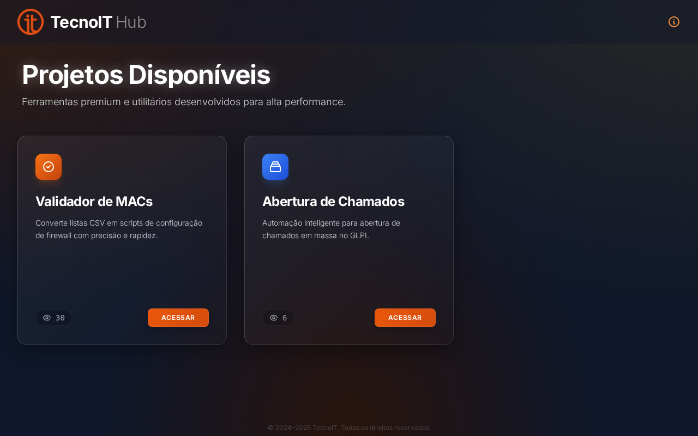

# TecnoIT - Hub de Projetos


## 📌 Visão Geral / Overview

**[PT]**
Bem-vindo ao **TecnoIT**, um portfólio centralizado e hub de ferramentas de automação desenvolvidas para otimizar processos de TI e segurança de redes. Este repositório reúne soluções práticas para desafios do dia a dia, como validação de dados de firewall e automação de chamados.

**[EN]**
Welcome to **TecnoIT**, a centralized portfolio and hub for automation tools designed to optimize IT and network security processes. This repository gathers practical solutions for daily challenges, such as firewall data validation and ticket automation.

---

### ⚠️ Declaração de Autoria / Authorship Disclaimer

**[PT]**
Este projeto foi desenvolvido de forma **totalmente independente** por **Marcelo Rodrigues**.
Não foi encomendado, solicitado, patrocinado ou remunerado por nenhuma empresa. Este é um projeto pessoal demonstrando capacidades técnicas e de resolução de problemas.

**[EN]**
This project was developed **completely independently** by **Marcelo Rodrigues**.
It was not commissioned, requested, sponsored, or remunerated by any company. This is a personal project showcasing technical and problem-solving capabilities.

---

## 🚀 Demonstração / Demo

Acesse a versão online hospedada no GitHub Pages:
**[https://marcelordpj.github.io/Tecnoit/](https://marcelordpj.github.io/Tecnoit/)**



---

## 🛠️ Projetos / Projects

### 1. [Validador de MACs / Firewall MAC Validator](projects/validador-firewall/README.md)
**[PT]** Ferramenta web moderna para converter listas CSV de endereços MAC em scripts de configuração de firewall Fortigate/Cisco, com validação de erros e detecção de duplicatas.
**[EN]** Modern web tool to convert CSV lists of MAC addresses into Fortigate/Cisco firewall configuration scripts, featuring error validation and duplicate detection.

### 2. Abertura de Chamados GLPI / GLPI Ticket Automation
*(Em breve / Coming Soon)*
**[PT]** Script de automação para criação em massa de chamados.
**[EN]** Automation script for bulk ticket creation.

---

## 💻 Tecnologias / Technologies

*   **Frontend:** HTML5, CSS3 (Tailwind CSS via CDN)
*   **Scripting:** JavaScript (Vanilla), Python (Automation scripts)
*   **Design:** Glassmorphism UI, Responsive Grid
*   **Hosting:** GitHub Pages

---

## ⚙️ Executando Localmente / Running Locally

Para testar ou desenvolver novas ferramentas localmente:

1.  **Clone o repositório:**
    ```bash
    git clone https://github.com/MarceloRDPJ/Tecnoit.git
    cd Tecnoit
    ```

2.  **Inicie um servidor local (Python):**
    ```bash
    python3 -m http.server 8000
    ```

3.  **Acesse:**
    Abra `http://localhost:8000` no seu navegador.

---

## 🗺️ Roadmap

- [x] **v1.0**: Lançamento do Hub e Validador de MACs.
- [x] **v1.1**: UI Update (Ultra Modern Dark Theme).
- [ ] **v2.0**: Integração com API do GLPI.
- [ ] **v2.1**: Ferramenta de conversão de Logs.

---

## 👤 Autor / Author

**Marcelo Rodrigues**
*   Desenvolvedor Full Stack & Especialista em Automação
*   [GitHub Profile](https://github.com/MarceloRDPJ)

---

## 📄 Licença / License

Este projeto está licenciado sob a **Licença MIT**. Veja o arquivo [LICENSE](LICENSE) para mais detalhes.
