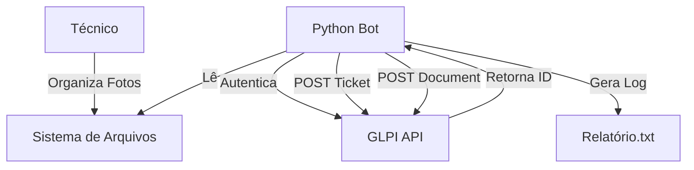

# Automação GLPI - RDP Studio


> **Orquestrador autônomo para abertura massiva de tickets.**
> Revolucione a gestão de preventivas com um script que varre diretórios, identifica evidências e cria chamados automaticamente.

---

## 📋 Visão Geral

Este projeto foi desenvolvido para a **TecnoIT** visando eliminar o trabalho manual repetitivo na abertura de chamados preventivos no GLPI. O sistema opera lendo uma estrutura de pastas padronizada, onde cada pasta representa um equipamento, e o conteúdo (fotos) serve como evidência.

### Principais Funcionalidades
- 📂 **Varredura Recursiva:** Identifica automaticamente novos chamados baseados em pastas.
- 📸 **Upload de Evidências:** Anexa fotos (JPG/PNG) ao chamado via API.
- 🔗 **Linkagem Inteligente:** Associa o chamado à entidade e categoria corretas.
- 📝 **Log de Auditoria:** Gera relatórios detalhados de sucesso/falha.

---

## 🏗️ Arquitetura



## 🚀 Como Usar

1.  **Organize as Pastas:**
    Crie uma estrutura `CLIENTE / TIPO / EQUIPAMENTO`.
2.  **Configure o `.env`:**
    ```env
    GLPI_URL=https://seu-glpi.com/apirest.php
    APP_TOKEN=seu_app_token
    USER_TOKEN=seu_user_token
    ```
3.  **Execute o Script:**
    ```bash
    python glpi_automator.py
    ```

## 🛠️ Stack Tecnológica

- **Linguagem:** Python 3.11
- **Bibliotecas:** `requests`, `os`, `logging`
- **Integração:** GLPI REST API

---

**© 2025 RDP STUDIO.** Desenvolvido por Marcelo Rodrigues.
