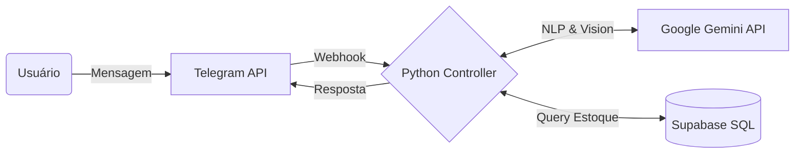

# Assistente de Vendas IA (Telegram)

> **Status:** Ativo
> **Versão:** 1.2 (Neuro-Symbolic AI)
> **Tecnologia:** Python 3.11, Google Gemini Pro, Supabase, Aiogram

## 📋 Visão Geral

O **Assistente de Vendas IA** é um agente autônomo projetado para revolucionar o atendimento ao cliente via Telegram. Diferente de chatbots tradicionais baseados em árvores de decisão fixas (menus), este assistente utiliza um **LLM (Large Language Model)** para entender linguagem natural, intenção de compra e contexto.

Ele atua como um vendedor sênior: verifica estoque em tempo real, calcula preços, negocia (dentro de limites) e até valida comprovantes de pagamento visualmente.

## 🚀 Diferenciais Técnicos

### 🧠 Cérebro Cognitivo (Gemini Pro)
O núcleo do bot utiliza a API do Google Gemini Pro configurada com um "System Prompt" robusto que define a personalidade da marca e as regras de negócio. Isso permite conversas fluídas como:
> *Cliente:* "Vocês tem aquele batom vermelho da linha matte?"
> *IA:* "Sim! Temos o 'Red Velvet' em estoque. Ele custa R$ 49,90. Quer ver uma foto?"

### 👁️ Visão Computacional (Pagamentos)
O bot aceita imagens enviadas pelo usuário. Se o cliente envia um "print" de um comprovante Pix, o agente:
1.  Analisa a imagem usando OCR/Visão Computacional.
2.  Extrai dados chaves (Valor, Data, Destinatário).
3.  Compara com o valor do pedido em aberto.
4.  Aprova ou rejeita a transação automaticamente.

### 🗄️ Integração com Banco de Dados (Supabase)
Todo o inventário e histórico de pedidos reside em um banco PostgreSQL (Supabase). O Python utiliza chamadas assíncronas (`asyncpg`) para garantir alta performance mesmo com múltiplos usuários simultâneos.

## 🔄 Fluxo de Arquitetura

## 🛠️ Stack Tecnológica

*   **Aiogram 3.x:** Framework assíncrono moderno para bots Telegram.
*   **Google Generative AI SDK:** Interface com o modelo Gemini.
*   **Supabase (PostgreSQL):** Persistência de dados e Vetor Store (para busca semântica de produtos).
*   **Python Decouple:** Gestão segura de variáveis de ambiente.

---
**Nota:** Este projeto demonstra a capacidade de integrar IA Generativa em processos de negócios críticos (Vendas e Finanças).

**Desenvolvido por Marcelo Rodrigues (RDP Studio)**
