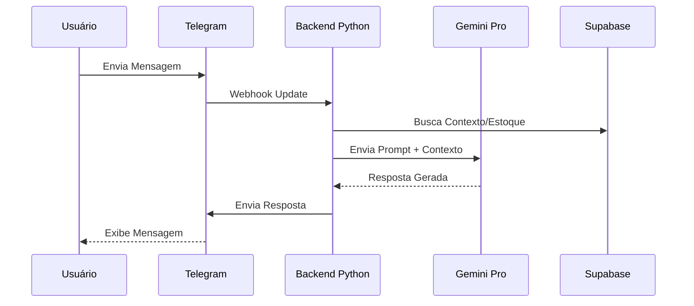

# Assistente de Vendas IA

> **Agente de IA Autônomo para Vendas e Gestão.**
> Atendimento 24/7, gestão de estoque e validação de pagamentos via visão computacional.

---

## 📋 Visão Geral

Desenvolvido para a **Lume Beauty**, este bot revoluciona o atendimento ao cliente no Telegram. Diferente de chatbots baseados em regras simples, ele utiliza **LLMs (Gemini 1.5 Pro)** para entender contexto, negociar e fechar vendas de forma natural.

### Principais Funcionalidades
- 💬 **NLP Avançado:** Conversação natural e contextual.
- 📦 **Gestão de Estoque:** Consulta e baixa de produtos em tempo real (Supabase).
- 👁️ **Visão Computacional:** Lê comprovantes de PIX enviados por foto para validar pagamentos.
- 🚀 **Alta Disponibilidade:** Arquitetura Serverless.

---

## 🏗️ Arquitetura

## 🛠️ Stack Tecnológica

- **Core:** Python 3.11, Aiogram
- **AI Model:** Google Gemini 1.5 Pro
- **Database:** Supabase (PostgreSQL + Vector)
- **Deploy:** Render / Docker

---

**© 2025 RDP STUDIO.** Desenvolvido por Marcelo Rodrigues.
