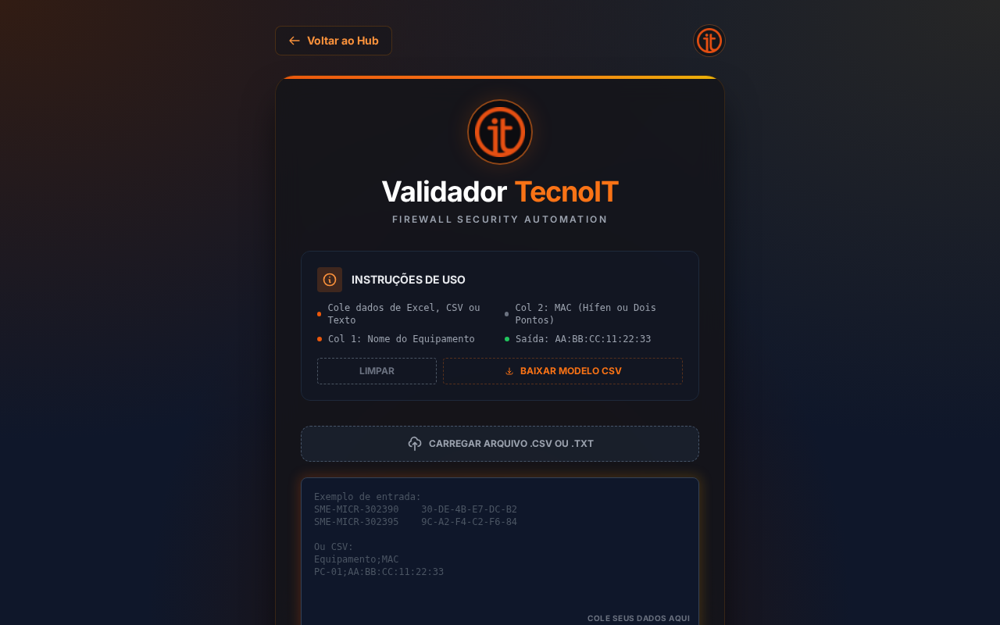
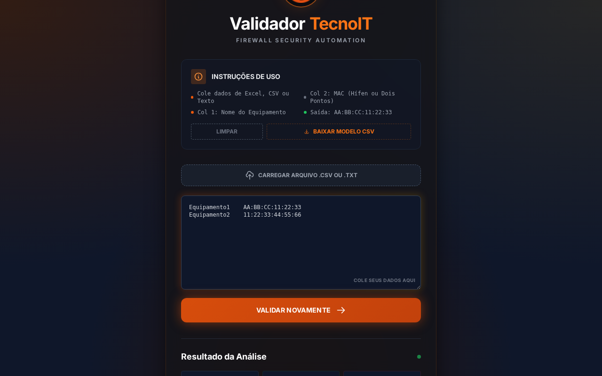

# Validador de MACs - TecnoIT


**[PT]** Ferramenta profissional para validação e conversão de endereços MAC para configurações de Firewall.
**[EN]** Professional tool for MAC address validation and conversion for Firewall configurations.

---

### ⚠️ Declaração de Autoria / Authorship Disclaimer

**[PT]**
Este projeto foi desenvolvido de forma **totalmente independente** por **Marcelo Rodrigues**.
Não foi encomendado, solicitado ou remunerado por nenhuma empresa.

**[EN]**
This project was developed **completely independently** by **Marcelo Rodrigues**.
It was not commissioned, requested, or remunerated by any company.

---

## 📸 Screenshots

### Interface Principal / Main Interface


### Resultados da Validação / Validation Results


---

## ✨ Funcionalidades / Features

1.  **Entrada Flexível:** Aceita Colar (Ctrl+V) ou Upload de arquivo `.csv` / `.txt`.
2.  **Validação Inteligente:**
    *   Verifica formato do MAC (aceita `:` ou `-`).
    *   Detecta duplicatas de MAC e de Nome.
    *   Identifica linhas incompletas.
3.  **Conversão Automática:** Formata para `XX:XX:XX:XX:XX:XX` (Padrão Firewall).
4.  **Scripts Gerados:**
    *   **Objeto (Address):** Cria os objetos individuais.
    *   **Grupo (Addrgrp):** Adiciona todos os objetos a um grupo.
5.  **Relatório de Erros:** Gera um CSV detalhando quais linhas falharam e o motivo.
6.  **Visualização Rápida:** Modais interativos para visualizar e copiar os scripts sem download.

---

## 🚀 Como Usar / How to Use

1.  Acesse a **[Demonstração Online](https://marcelordpj.github.io/Tecnoit/projects/validador-firewall/index.html)**.
2.  Cole os dados na caixa de texto OU arraste um arquivo CSV.
    *   *Formato esperado:* `Nome;MAC` (separado por ponto e vírgula, tab ou espaço).
3.  Clique em **"VALIDAR & CONVERTER"**.
4.  Analise o resumo no painel de resultados.
5.  Use os botões para visualizar (`Visualizar & Copiar`) ou baixar (`Baixar .TXT`) os scripts gerados.

---

## 📋 Exemplo de Entrada / Input Example

```text
PC-Financeiro-01    AA-BB-CC-11-22-33
Server-Backup       00:11:22:33:44:55
Laptop-Guest        AABBCC112233
```

## 💻 Tecnologias / Technologies

*   **HTML5 & JavaScript (Vanilla)** - Processamento 100% no cliente (Client-side).
*   **Tailwind CSS** - Design responsivo e tema escuro moderno.
*   **FileReader API** - Leitura de arquivos locais segura.

---

## 👤 Autor / Author

**Marcelo Rodrigues**
*   [GitHub Profile](https://github.com/MarceloRDPJ)

---

## 📄 Licença / License

Distribuído sob a licença MIT. Veja `LICENSE` na raiz do repositório para mais informações.
