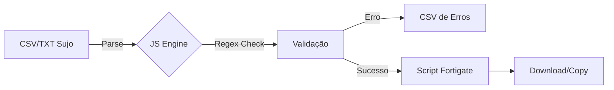

# Validador de Firewall (MACs)

> **Engine de Conformidade e Automação para Firewalls.**
> Sanitize listas de MAC Address, valide formatos e gere scripts Fortigate em segundos.

---

## 📋 Visão Geral

Ferramenta essencial para administradores de rede e segurança. O Validador resolve o problema comum de receber listas de ativos despadronizadas (Excel, CSV, TXT) e precisar importá-las em Firewalls (Fortigate).

### Principais Funcionalidades
- 🧹 **Sanitização de Dados:** Remove caracteres inválidos e corrige formatação.
- 🔍 **Detecção de Duplicatas:** Impede que MACs ou Nomes repetidos quebrem a importação.
- ⚙️ **Gerador de Scripts:** Cria comandos CLI prontos para "Copiar e Colar" no terminal do Firewall.
- 🛡️ **Segurança:** Processamento 100% local (Client-side), garantindo privacidade dos dados.

---

## 🏗️ Fluxo de Processamento

## 🚀 Como Usar

1.  Cole sua lista de equipamentos (Nome + MAC) na área de texto.
2.  Clique em **"Validar & Converter"**.
3.  Visualize os resultados nas abas de "Objetos" e "Grupos".
4.  Baixe os scripts gerados.

## 🛠️ Stack Tecnológica

- **Core:** JavaScript ES6+
- **Interface:** HTML5 + Tailwind CSS (Glassmorphism)
- **Logic:** Regex Patterns for MAC Validation

---

**© 2025 RDP STUDIO.** Desenvolvido por Marcelo Rodrigues.
